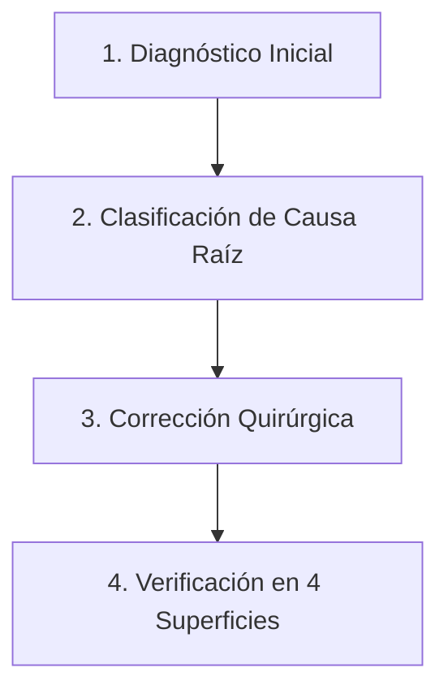

# 🩺 Protocolo Oficial de Diagnóstico y Resolución de Errores - DATAX Platform

Este documento define el protocolo estricto para investigar, clasificar, reparar y verificar incidentes en la plataforma de datos (Descarga, Conversión, Migración, Pipeline Monitor y Taiga).

---

## 1. 🔍 Ciclo de Resolución en 4 Fases (Loop Cerrado)

Todo incidente reportado por el usuario o detectado en la plataforma DEBE seguir este ciclo sin saltarse ningún paso:



### Fase 1: Diagnóstico Quirúrgico (Evidencia Real)
- **NUNCA adivinar.** Obtener siempre la evidencia antes de proponer cambios.
- **Fuentes de consulta inmediata:**
  1. **Monitor API:** `GET http://10.0.0.16:8090/api/audit?country=<PAIS>`
     - Evaluar `overall_status`, `is_desfase`, `active_structure_errors`, `active_exceptions`, `lag_reasons`.
  2. **Taiga API:** `GET /userstories?project=9` buscando por código de reporte o estado `New` (ID: 50).
  3. **Airflow Worker:** Inspeccionar el log exacto en `/opt/airflow/logs/dag_id=<DAG>/run_id=<RUN>/task_id=<TASK>/attempt=1.log`.
  4. **Bases de Datos:**
     - `platform_db`: Tabla `report` (`converted_to`, `migrated_to`, `load_scope`), `conversion_exceptions`.
     - `DATA_DB_<PAIS>`: Tabla destino (`SELECT COUNT(*), fecha, COUNT(*) GROUP BY fecha`).

### Fase 2: Clasificación de Causa Raíz (Ver Catálogo en Sección 2)
Determinar si la falla es de infraestructura/datos históricos, código de conversión, concurrencia en Airflow o modelo de migración.

### Fase 3: Corrección Quirúrgica
- Aplicar el fix mínimo y suficiente.
- Desplegar el código modificado al contenedor worker (`docker cp` o git pull).
- Si hubo errores de estructura falsos, limpiar las carpetas de anomalía en `/mnt/datos1/data_process/...` para que el monitor no mantenga alertas fantasmas.

### Fase 4: Verificación en 4 Superficies (Obligatorio)
No dar por cerrado un error hasta validar las 4 superficies:
1. **Airflow DAG Run:** Ejecución exitosa de todas las tareas (ej. `structure_review -> success`, `post_load -> success`).
2. **PostgreSQL:** Registros correctos y consistentes sin duplicados en `DATA_DB_<PAIS>`.
3. **Pipeline Monitor:** El robot debe figurar como `Overall status: SYNCED`, sin desfases ni errores activos.
4. **Taiga:** La User Story asociada al incidente debe actualizarse a estado **`Done`** (ID: 54 / `is_closed: True`).

---

## 2. 📚 Catálogo de Errores Conocidos y Respuestas Inmediatas

| Síntoma / Error en Log | Causa Raíz | Procedimiento de Solución |
| :--- | :--- | :--- |
| `sqlite3.OperationalError: no such table: columns_to_review` | El SQLite anterior en `/mnt/datos1/data_process/...` no tiene la tabla `columns_to_review`. Airflow lo toma como cambio de estructura. | Inyectar tabla `columns_to_review` con `['nv1', ..., 'nvN']` en el SQLite de referencia. Limpiar carpeta de anomalía y re-ejecutar `C_...`. |
| `Level verification failed: Column 'nvX' contains values that do not match expected levels: '-'` | Se asignó `"-"` o `"nan"` a un nivel jerárquico terminal en vez de `None`. `isLevel()` compara cadenas y falla con caracteres no alfanuméricos. | Cambiar la asignación de término/instrumento a `None` cuando no aplique (`if not term or term == "-": term = None`). |
| `post_load_error`: `num_records_added != load_metadata['num_records']` | Filas duplicadas en la tabla PostgreSQL causadas por ejecuciones concurrentes o fallidas previas. | Consultar duplicados en PostgreSQL por fecha. Limpiar duplicados (`DELETE`). Re-ejecutar migración con el config del último SQLite. |
| `No se encontró reporte en BD para report_code='D_...' (DAG: C_...)` | Al disparar manualmente la conversión `C_...`, se pasó el código padre del archivo (`D_BO_000000XXX`) en vez del código del subreporte (`D_BO_000000XXX_01`). | Disparar `C_...` pasando en `--conf` el código exacto del subreporte registrado en `report.code`. |
| `read_file`: `No module named 'models.conversion.C_...'` | El archivo `.py` del robot de conversión no existe en `/opt/airflow/models/conversion/` en el worker. | Copiar el archivo al worker (`docker cp`) y verificar permisos. |
| `Desfase / Falta Migrar` (`converted_to > migrated_to`) | La conversión avanzó pero la migración falló en `post_load` o no se disparó. | Identificar el último SQLite en `/mnt/datos1/data_process/...` y disparar el DAG `M_...` con su configuración completa. |

---

## 3. 🛡️ Reglas de Seguridad Operativa
1. **Configuración Estricta de Disparo de Conversión:**
   ```bash
   airflow dags trigger C_<PAIS>_<ID_BASE> --conf '{"file": "<RUTA_ARCHIVO>", "code": "<CODIGO_SUBREPORTE_XX>", "id_download": 1}'
   ```
2. **Configuración Estricta de Disparo de Migración:**
   ```bash
   airflow dags trigger M_<PAIS>_<ID_BASE> --conf '{"code": "<CODIGO_SUBREPORTE_XX>", "conversion_path": "<RUTA_SQLITE>", "id_conversion": 1}'
   ```
3. **No dejar huérfanas carpetas de anomalía resueltas:** Si una alerta de cambio de estructura fue diagnosticada como falsa alarma o resuelta, eliminar la carpeta `__report_structure_change` en `/mnt/datos1/data_process/...` para mantener limpios los radares del Monitor.
